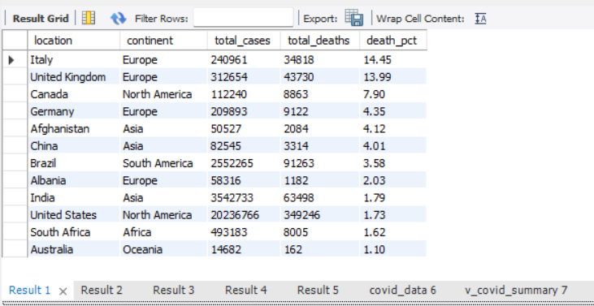
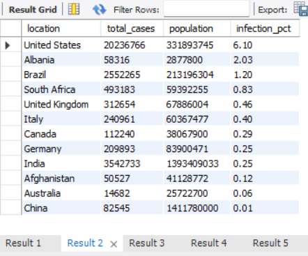
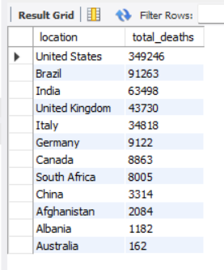
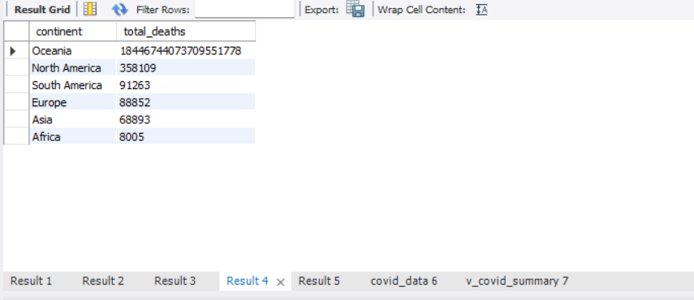
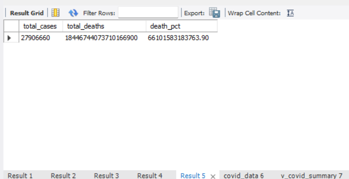
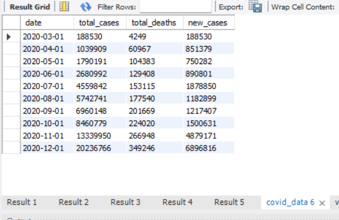
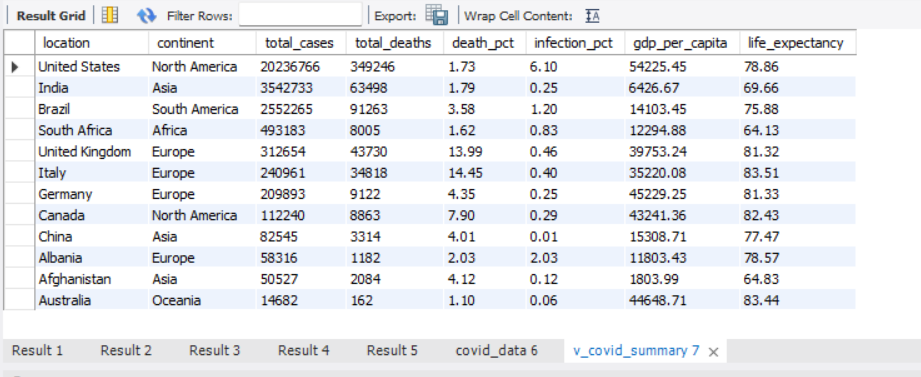

# COVID-19 Global Data Exploration — SQL

## Project Overview
Exploratory data analysis of global COVID-19 data using MySQL — 
analysing infection rates, death percentages, and case trends 
across 12 countries spanning 2020.

## Business Problem
Governments and health organisations need data-driven insights 
on COVID-19 spread, mortality rates, and population impact to 
inform policy decisions and resource allocation.

## Tools & Skills
- MySQL — GROUP BY, AGGREGATE FUNCTIONS, CAST, NULLIF
- Window Functions, CTEs, CREATE VIEW
- Data Exploration & Business Insight Generation

## Key Business Insights
- 🇮🇹 Italy had the highest death rate at 14.45% 
- 🇺🇸 USA had most total cases — 20.2M by end of 2020
- 🇺🇸 USA monthly cases grew from 188K (Mar) to 20M (Dec) — 107x increase
- 🇦🇱 Albania had 2.03% infection rate — highest % of population infected
- High GDP countries (USA $54K, Germany $45K) had lower death rates than Italy despite more cases
- India managed 1.79% death rate despite 3.5M cases — lowest among major nations

## Screenshots

## Author
**Kabilan Ramachandran**  
linkedin.com/in/kabilan-ramachandran  
github.com/kabilanramachandran
